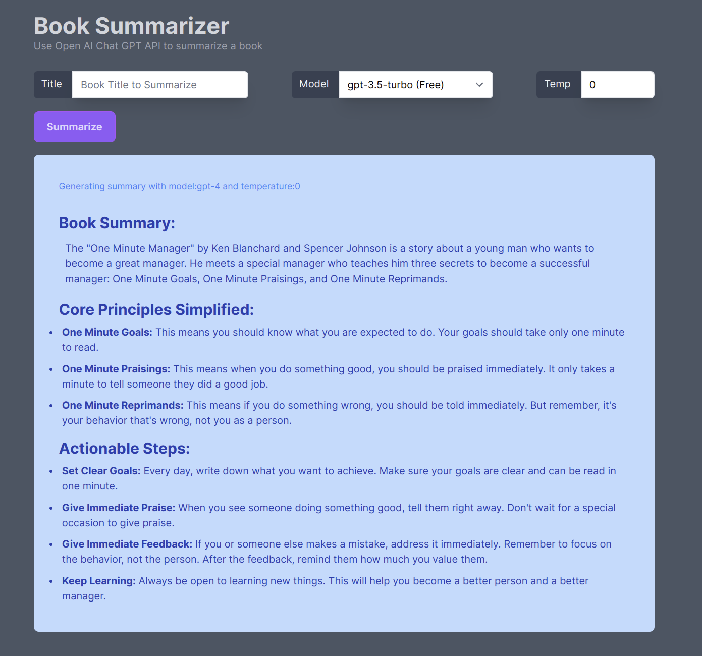

# Summarize a Book using OpenAI ChatGPT Rails App

## App Setup
- Using Rails 7.1.3, Ruby 3.3.0, ImportMaps, TailwindCSS, SqlLite3, PropShaft
   > `rails new (appname) --asset-pipeline=propshaft --javascript=importmap --css=tailwind --database=sqlite3`

- Install and run a redis server
  > - https://redis.io/docs/install/install-redis/
  > - The app uses TurboStreams which requires redis to be running
  > - Redis isn't running if you see an error similar to this `Connection refused - connect(2) for 127.0.0.1:6379`
  > - On Ubuntu you may be able install redis as follows, but check the latest documentation for your setup:
  > ```
  > sudo apt-get install redis-server
  > sudo service redis-server restart
  > ```

- To get PropShaft to work with the view_component gem the following solution was followed:
  https://github.com/rails/propshaft/issues/87#issuecomment-1127234248

- view components were generated using the following command: 
  `bin/rails g component (name) [(attr1)...] --stimulus`
  > Using the `--sidecar` options makes the controller names too long
   
- In the case of the `nav` view components the generated code was modified to add `Nav::` and `nav--` as needed.

- The modern flash messages where adopted almost verbatim from 
  [Modern Rails flash messages (part 1): ViewComponent, Stimulus & Tailwind CSS](
   https://dev.to/citronak/modern-rails-flash-messages-part-1-viewcomponent-stimulus-tailwind-css-3alm). 
  The code was modified as needed to make it work with current versions of Rails, Turbo and Stimulus.
  Font Awesome usage is currently commented out in favor character icons, but may be added 
  see `views/layout/application.html.erb` and `app/frontend/components/notification_component.rb`


  

* * *

## Running the app
1. Pull down book_summary repo and cd into the directory

2. `bin/bundle install`

3. `bin/bundle db:setup`

4. Add your OpenAPI key to the credentials

   >- `EDITOR=(emacs|code|vi) bin/rails credentials:edit`
   >- Update the `openai_api_key` with your OpenAI API token

   >- Alternatively define an ENV variable by the same name with the key value.

5. bin/dev

6. visit http://127.0.0.1:3000/ 

## TODOS
- Consider using devise to make user specific defaults
- Add BookSummary model and save results for later review and sharing
- Allow Prompts to be created, saved and reused

### App screen shot 
- _as of Feb 11, 2024_
