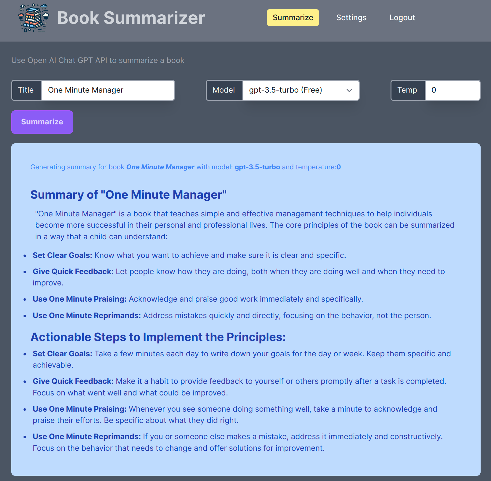

# Summarize a Book using OpenAI ChatGPT Rails App

## App Setup
- Using Rails 7.1.3, Ruby 3.3.0, ImportMaps, TailwindCSS, SqlLite3, PropShaft
   > `rails new (appname) --asset-pipeline=propshaft --javascript=importmap --css=tailwind --database=sqlite3`

- Install and run a redis server
  > - https://redis.io/docs/install/install-redis/
  > - The app uses TurboStreams which requires redis to be running
  > - Redis isn't running if you see an error similar to this `Connection refused - connect(2) for 127.0.0.1:6379`
  > - On Ubuntu you may be able install redis as follows, but check the latest documentation for your setup:
  > ```
  > sudo apt-get install redis-server
  > sudo service redis-server restart
  > ```

* * *

## Running the app
1. Pull down book_summary repo and cd into the directory

2. `bin/bundle install`

3. `bin/bundle db:setup`

4. Add your OpenAPI key to the credentials

   >- `EDITOR=(emacs|code|vi) bin/rails credentials:edit`
   >- Update the `openai_api_key` with your OpenAI API token

   >- Alternatively define an ENV variable by the same name with the key value.

5. bin/dev

6. visit http://127.0.0.1:3000/ 

## TODOS
- Currently using global TurboStream for chucking summary
- Add devise user and make the summary chucking session specific
- Add BookSummary model and save results for later review and sharing
- Allow Prompts to be created, saved and reused

### _App screen shot as of Feb 10, 2024_
